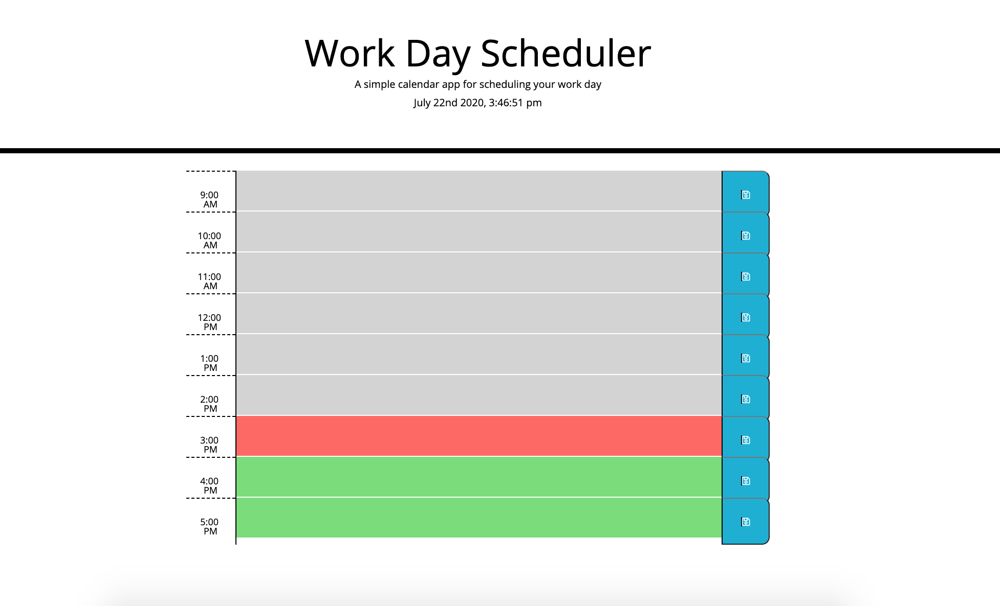

This is a simple workday scheduler. 
This application allows for the user to input and save events for each hour of the day. 
When the scheduler is opened, the top will display the current day and time. Each time block is color coded depending on the time of day- gray for past, red for present and green for future. Once the user is ready to save, they can click on the save button and the input data will be saved in the user's local storage. Even when the page gets refreshed, the saved input will be displayed. 

The Moments.js library is used to display the date and time. 

[Work Day Scheduler](https://sbhwang23.github.io/Homework05/)

